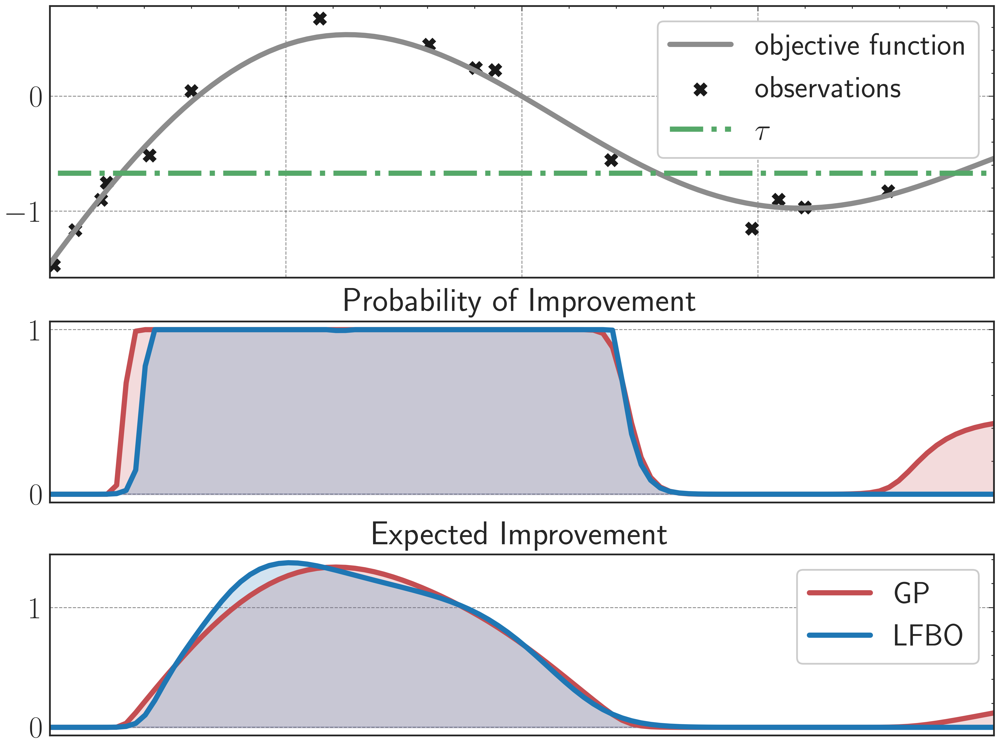

# A General Recipe for Likelihood-free Bayesian Optimization

[](https://arxiv.org/abs/2206.13035)
[](https://lfbo-ml.github.io)


> [**A General Recipe for Likelihood-free Bayesian Optimization**](https://arxiv.org/abs/2206.13035). <br/>
> [Jiaming Song*<sup>1</sup>](https://tsong.me/), [Lantao Yu*<sup>2</sup>](http://lantaoyu.com/), [Willie Neiswanger<sup>2</sup>](https://willieneis.github.io/), [Stefano Ermon<sup>2</sup>](https://cs.stanford.edu/~ermon/) <br/>
> <sup>1</sup>NVIDIA, <sup>2</sup>Stanford University *Equal contribution


## ✨ Overview
The acquisition function, a critical component in Bayesian optimization (BO), can often be written as the expectation of a utility function under a surrogate model. However, to ensure that acquisition functions are tractable to optimize, restrictions must be placed on the surrogate model and utility function. To extend BO to a broader class of models and utilities, we propose likelihood-free BO (LFBO), an approach based on likelihood-free inference.

LFBO directly models the acquisition function without having to separately perform inference with a probabilistic surrogate model. We show that computing the acquisition function in LFBO can be reduced to optimizing a weighted classification problem, where the weights correspond to the utility being chosen. LFBO outperforms various state-of-the-art black-box optimization methods on several real-world optimization problems. LFBO can also effectively leverage composite structures of the objective function, which further improves its regret by several orders of magnitude.

## 🔨 Getting started
Install required packages:
```pip install -r requirements.txt```

Download and install datasets: [HPOBench](https://github.com/automl/nas_benchmarks) and [NAS-Bench-201](https://github.com/D-X-Y/NAS-Bench-201)

## ➡️ How to run LFBO
The `lfbo_benchmark.py` provides the basic script to run experiments on various datasets using different methods.
Here are some examples:

- For HPObench datasets, run LFBO (Expected Improvement) 200 steps for 100 random seeds sequentially using Random Forest classifier:
```
python lfbo_benchmark.py --benchmark fcnet_alt --dataset parkinsons --weight_type ei --model_type rf --iterations 200 --start_seed 0 --end_seed 99
```
Alternatively, for HPOBench datasets with MLP/Random Forest classifiers (`--model_type mlp` or `--model_type rf`), you may use `bash parallel_run.sh` to launch multiple jobs in parallel.

- For NAS-Bench-201 datasets, run LFBO (Expected Improvement) 200 steps for 100 random seeds sequentially using XGBoost classifier:
```
python lfbo_benchmark.py --benchmark nasbench201 --dataset cifar100 --weight_type ei --model_type xgb --iterations 200 --start_seed 0 --end_seed 99
```

- All choices for these arguments can be found [here](https://github.com/lfbo-ml/lfbo/blob/main/lfbo_benchmark.py#L8-L15) or `python lfbo_benchmark.py -h`.

- After running the experiments, you may use `plot_results.py` to generate the results in [`figures/`](https://github.com/lfbo-ml/lfbo/tree/main/figures).

## ✏️ Reference
If you think this project is helpful, please feel free to give a star⭐️ and cite our paper:
```
@inproceedings{song2022a,
  title={A General Recipe for Likelihood-free Bayesian Optimization},
  author={Song*, Jiaming and Yu*, Lantao and Neiswanger, Willie and Ermon, Stefano},
  booktitle={International Conference on Machine Learning},
  year={2022}
}

```

## 👍 Acknowledgements
This implementation is based on [BORE](https://github.com/ltiao/bore).
